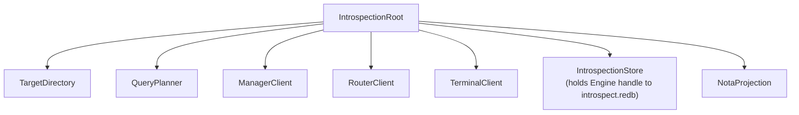

# persona-introspect - architecture

*Persona inspection-plane daemon and CLI.*

## 0. Intent

`persona-introspect` is the prototype's inspection-plane component. It is
supervised alongside the operational first stack and gives the engine a way to
explain itself through typed component observations.

It is not in the message delivery path. It proves the delivery path after the
fact.

## 1. Owned surface

- `persona-introspect-daemon`
- `introspect` CLI
- Kameo actors for query planning, target directory, target clients, NOTA
  projection, and `IntrospectionStore` (state-bearing local store).
- Fan-out to component daemons over Signal.
- Fan-in of typed observations.
- **`introspect.redb`** — persona-introspect's own typed database,
  opened through `sema-engine`. Stores: query/reply/error audit
  trail; subscription registrations (post-Slice 3); correlation
  cache keyed by `CorrelationId` (post-Slice 3, populated by
  Subscribe deltas from peer streams).
- NOTA projection for humans, agents, and future UIs.

## 2. Non-ownership

This component does not own:

- `mind.redb`
- `router.redb`
- `terminal.redb`
- other peer component databases
- component row definitions
- router policy
- terminal delivery policy
- manager lifecycle policy

Every live observation crosses a component daemon boundary. Peer state
is reached only through peer daemon sockets and component contracts —
**never by opening peer redb files**. Offline redb readers, if they ever
exist, are separate debug tools.

`persona-introspect` depends on `sema-engine` for its own
`introspect.redb`. That is a one-way dependency; `sema-engine`
knows nothing about persona-introspect.

## 3. Actor map

## 4. Constraints

| Constraint | Witness |
|---|---|
| The daemon does not open peer redb files. | Source scan and tests: no `redb::Database::open` in live path against peer paths. |
| The daemon opens `introspect.redb` through `sema-engine`. | Source scan: `Engine::open` call exists; no direct `redb` or `sema::Sema::open_with_schema` calls in this repo. |
| The CLI renders NOTA only at the edge. | CLI and projection tests; component clients return typed Signal replies; no `nota-codec` usage in daemon runtime path. |
| Prototype witness travels through Kameo actor root. | `tests/actor_runtime_truth.rs`. |
| The daemon binds `introspect.sock` and serves Signal frames. | `tests/daemon.rs` via `checks.*.test-daemon-socket`. |
| The daemon applies the managed spawn-envelope socket mode. | `checks.*.test-daemon-applies-spawn-envelope-socket-mode`. |
| Component observations remain component-owned. | Dependency graph: wraps `signal-persona-introspect`; target observation records come from each peer's `signal-persona-*` contract. |
| Every `IntrospectionRequest` variant declares a Signal root-verb mapping. | `signal_verb()` method on `IntrospectionRequest` (returns `signal_core::SemaVerb` until the signal-core `SignalVerb` rename lands) + round-trip tests asserting verb+payload alignment. All current variants are `Match`; `SubscribeComponent` (Slice 3) is `Subscribe`. |
| Subscription forwarding goes through `sema-engine`'s `Subscribe` primitive. | Source scan (Slice 3 witness): `Engine::subscribe` is the only path that registers introspect-side subscriptions to peer streams. |

## 5. Status

The daemon binds a Unix socket, applies the requested socket mode when supplied,
and serves `signal-persona-introspect` frames through the Kameo root. The
three-slice implementation plan:

- **Slice 1 (in progress):** verb-mapping witness + central envelope
  extension (ComponentObservations, ListRecordKinds,
  AwaitingCorrelationCache) + real `EngineSnapshot` /
  `ComponentSnapshot` / `PrototypeWitness` replies via Signal
  fan-out + introspect skeleton actor + record family type
  definitions + sema-engine dependency wired. `DeliveryTrace`
  returns `AwaitingCorrelationCache` until Slice 3.
- **Slice 2 (gated on sema-engine widening):** terminal +
  router observation contracts + handlers + introspect clients +
  CLI + Nix witness. Handler-side storage uses
  `Engine::register_index` + `QueryPlan::ByIndex` /
  `QueryPlan::ByKeyRange`.
- **Slice 3 (gated on sema-engine Subscribe + per-peer
  commit-then-emit):** `SubscribeComponent` wire variant + forwarded
  peer subscriptions + cache-backed `DeliveryTrace`. persona-introspect
  becomes a full sema-engine consumer for subscription registrations +
  correlation cache.
