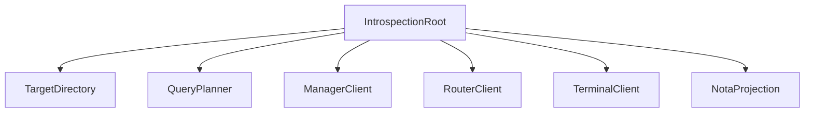

# persona-introspect - architecture

*Persona inspection-plane daemon and CLI.*

## 0. Intent

`persona-introspect` is the prototype's inspection-plane component. It is
supervised alongside the operational first stack and gives the engine a way to
explain itself through typed component observations.

It is not in the message delivery path. It proves the delivery path after the
fact.

## 1. Owned surface

- `persona-introspect-daemon`
- `introspect` CLI
- Kameo actors for query planning, target directory, target clients, and NOTA
  projection.
- Fan-out to component daemons over Signal.
- Fan-in of typed observations.
- NOTA projection for humans, agents, and future UIs.

## 2. Non-ownership

This component does not own:

- `mind.redb`
- `router.redb`
- `terminal.redb`
- other component databases
- component row definitions
- router policy
- terminal delivery policy
- manager lifecycle policy

Every live observation crosses a component daemon boundary. Offline redb
readers, if they ever exist, are separate debug tools.

## 3. Actor map

## 4. Constraints

| Constraint | Witness |
|---|---|
| The daemon does not open peer redb files. | Source scan and tests: no `redb::Database::open` in live path. |
| The CLI renders NOTA only at the edge. | CLI and projection tests; component clients return typed Signal replies. |
| Prototype witness travels through Kameo actor root. | `tests/actor_runtime_truth.rs`. |
| The daemon binds `introspect.sock` and serves Signal frames. | `tests/daemon.rs` via `checks.*.test-daemon-socket`. |
| Component observations remain component-owned. | Dependency graph: wraps `signal-persona-introspect`, target records come from component contracts. |

## 5. Prototype status

The daemon binds a Unix socket, applies the requested socket mode when supplied,
and serves `signal-persona-introspect` frames through the Kameo root. Current
component observations are intentionally scaffold replies: prototype witness,
component snapshot, and delivery trace report `Unknown` until manager, router,
and terminal observation relations are wired.
